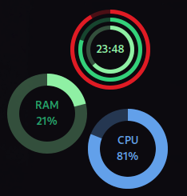
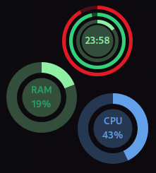
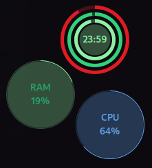
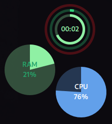

### Circular Widgets

A GNOME Shell extension to provide conky like widgets on gnome shell with few customization options, this extension aims to show system information on desktop 

 
 

### Features

- Drag and Drop Supports
- Resizable (but limited)
- Change color easily
- More customisation options enable for Clock
- Added Non Customisable Calendar Widget

Many feature will be added in the future


### Installation

1. Download zip file : https://github.com/raihan2000/circular-widgets
2. Extract to circular-widgets-master
3. make install

or

```
git clone https://github.com/raihan2000/circular-widgets.git
cd circular-widgets
make install
```

### Credits

This Extension is inspired from
[The Circles - Desktop Widget](https://extensions.gnome.org/extension/3748/the-circles-desktop-widget/) by xenatt and [Desktop Clock](https://extensions.gnome.org/extension/5156/desktop-clock/) by andrew.zaech
